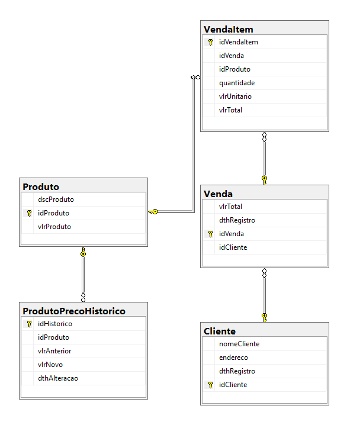

# Documentação Técnica — Loja do Sr. Campos

## 1. Stack Tecnológica

| Camada | Tecnologia |
|---|---|
| Web | ASP.NET MVC 5.2 (.NET Framework 4.8) |
| Views | Razor (CSHTML) + Bootstrap 4 + jQuery |
| ORM | Entity Framework 6.5 (Code First Migrations) |
| Banco de dados | SQL Server (LocalDB / Express) |
| Mediator / CQRS | MediatR 9.0 |
| Geração de IDs | Medo.Uuid7 (UUID v7 ordenável para SQL Server) |
| Testes unitários | xUnit 2.4 + Moq 4.18 |

---

## 2. Projetos da Solução

| Projeto | Tipo | Responsabilidade |
|---|---|---|
| `TesteCamposDealer.Domain` | Class Library (.NET 4.8) | Entidades de domínio e interfaces dos repositórios |
| `TesteCamposDealer.Application` | Class Library (.NET 4.8) | Handlers CQRS, validators, behaviors, DTOs e exceções |
| `TesteCamposDealer.Infrastructure` | Class Library (.NET 4.8) | DbContext, migrations e implementação dos repositórios |
| `TesteCamposDealer.API` | ASP.NET MVC 5.2 (.NET 4.8) | Controllers JSON, ViewModels, mappers e configuração de DI |
| `TesteCamposDealer.Web` | ASP.NET MVC 5.2 (.NET 4.8) | Interface web — CRUD de vendas via Razor + chamadas HTTP à API |
| `TesteCamposDealer.Tests` | xUnit (.NET 4.8) | Testes unitários de handlers e repositórios |

---

## 3. Arquitetura

A solução segue **Clean Architecture** em 4 projetos com dependências unidirecionais:

```
Domain ← Application ← Infrastructure
                ↑
              API  ←  Web
```

- **Domain** — núcleo sem dependências externas: entidades (`Cliente`, `Produto`, `Venda`, `VendaItem`, `ProdutoPrecoHistorico`) e interfaces dos repositórios (`IClienteRepository`, `IProdutoRepository`, `IVendaRepository`, `IUnitOfWork`).
- **Application** — lógica de negócio: handlers MediatR, validators, `ValidationBehavior`, DTOs e exceções tipadas. Depende apenas do Domain.
- **Infrastructure** — implementação da persistência: `AppDbContext`, migrations EF6 e repositórios concretos. Depende do Domain.
- **API** — superfície HTTP JSON: controllers MVC que recebem requisições, delegam ao MediatR e retornam JSON. Depende de Application e Infrastructure.
- **Web** — interface Razor: controllers que consomem a API via `HttpClient` (`ApiClient`) e devolvem views HTML renderizadas. Totalmente desacoplado do domínio — comunica-se exclusivamente com a API.

### 3.1 Padrão CQRS com MediatR

Todos os casos de uso são implementados como `IRequest<T>` processados por `IRequestHandler<TRequest, TResponse>`. Isso separa leitura de escrita e isola a lógica de negócio dos controllers:

- **Commands**: `CreateClienteCommand`, `UpdateProdutoCommand`, `CreateVendaCommand`, etc.
- **Queries**: `GetAllVendasQuery`, `GetRankingQuery`, `GetVendasByClienteQuery`, etc.

### 3.2 Unit of Work + Repository

O `IUnitOfWork` agrupa os três repositórios (`IClienteRepository`, `IProdutoRepository`, `IVendaRepository`) e expõe um único `CommitAsync()`. Garante que alterações em múltiplas entidades sejam persistidas em uma única transação.

### 3.3 Pipeline de Validação

Um `ValidationBehavior<TRequest, TResponse>` intercepta todos os commands MediatR antes de chegarem ao handler. Se houver erros, lança `ValidationException`.

Na **API**, os controllers capturam a exceção e retornam HTTP 400 com os erros em JSON:

```csharp
catch (ValidationException ex)
{
    Response.StatusCode = 400;
    return Json(new { errors = ex.Errors
        .GroupBy(e => e.PropertyName)
        .ToDictionary(g => g.Key, g => g.Select(e => e.ErrorMessage)) });
}
```

No projeto **Web**, os controllers recebem a resposta HTTP da API e exibem o erro via `ModelState` ou `ViewBag`.

---

## 4. Modelagem de Dados

### 4.1 Diagrama de Entidades



```
Cliente
  ├── idCliente      UNIQUEIDENTIFIER (PK)
  ├── nomeCliente    VARCHAR(200)
  ├── endereco       VARCHAR(500)
  └── dthRegistro    DATETIME

Produto
  ├── idProduto      UNIQUEIDENTIFIER (PK)
  ├── dscProduto     NVARCHAR(200)
  ├── vlrProduto     DECIMAL(18,2)
  └── ProdutoPrecoHistorico (1:N)

ProdutoPrecoHistorico
  ├── idHistorico    UNIQUEIDENTIFIER (PK)
  ├── idProduto      UNIQUEIDENTIFIER (FK → Produto)
  ├── vlrAnterior    DECIMAL(18,2)
  ├── vlrNovo        DECIMAL(18,2)
  └── dthAlteracao   DATETIME

Venda
  ├── idVenda        UNIQUEIDENTIFIER (PK)
  ├── idCliente      UNIQUEIDENTIFIER (FK → Cliente)
  ├── vlrTotal       DECIMAL(18,2)
  ├── dthRegistro    DATETIME
  └── VendaItem (1:N)

VendaItem
  ├── idVendaItem    UNIQUEIDENTIFIER (PK)
  ├── idVenda        UNIQUEIDENTIFIER (FK → Venda)
  ├── idProduto      UNIQUEIDENTIFIER (FK → Produto)
  ├── quantidade     INT
  ├── vlrUnitario    DECIMAL(18,2)   ← preço capturado no momento da venda
  └── vlrTotal       DECIMAL(18,2)   ← quantidade × vlrUnitario
```

### 4.2 Decisão: UUID v7 em vez de INT auto-incremento

O esquema usava `INT` como PK. A evolução utilizou `UNIQUEIDENTIFIER` com **UUID v7** (biblioteca `Medo.Uuid7`), que:

- Gera IDs ordenados cronologicamente, eliminando fragmentação de índice no SQL Server
- Permite geração de IDs na aplicação sem round-trip ao banco
- Usa `NewMsSqlUniqueIdentifier()` que reordena os bytes para o critério de ordenação do SQL Server

---

## 5. Regras de Negócio

| Regra | Implementação |
|---|---|
| Venda exige ao menos um item | `CreateVendaCommandValidator` + `UpdateVendaCommandValidator` |
| Cliente da venda deve existir | `CreateVendaHandler` lança `NotFoundException` se não encontrar |
| Produto de cada item deve existir | Verificação por item no handler |
| `vlrUnitario` do item = preço do produto no momento da venda | Handler copia `produto.vlrProduto` para `VendaItem.vlrUnitario` |
| `vlrTotal` do item = quantidade × vlrUnitario | Calculado no handler |
| `vlrTotal` da venda = soma dos subtotais | `venda.Itens.Sum(i => i.vlrTotal)` |
| Histórico de preço criado ao alterar valor do produto | `UpdateProdutoHandler` compara valor anterior e registra histórico se diferente |
| Preço anterior não é alterado em vendas já registradas | `vlrUnitario` fica no `VendaItem`, não é FK para `Produto.vlrProduto` |

---

## 6. Rotas

### 6.1 API JSON — `TesteCamposDealer.API`

Base URL: `https://localhost:44302`  
Todas as respostas são JSON. Rotas definidas via attribute routing (`[RoutePrefix]` + `[Route]`).

**Clientes**

| Método | Rota | Ação |
|---|---|---|
| GET | `/api/clientes` | Lista paginada |
| GET | `/api/clientes/{id}` | Busca por ID |
| POST | `/api/clientes` | Cria cliente |
| PUT | `/api/clientes/{id}` | Atualiza cliente |
| DELETE | `/api/clientes/{id}` | Remove cliente |

**Produtos**

| Método | Rota | Ação |
|---|---|---|
| GET | `/api/produtos` | Lista paginada |
| GET | `/api/produtos/{id}` | Busca por ID |
| POST | `/api/produtos` | Cria produto |
| PUT | `/api/produtos/{id}` | Atualiza produto (registra histórico de preço se valor mudar) |
| DELETE | `/api/produtos/{id}` | Remove produto |

**Vendas**

| Método | Rota | Ação |
|---|---|---|
| GET | `/api/vendas` | Lista paginada |
| GET | `/api/vendas/{id}` | Busca por ID |
| GET | `/api/vendas/ranking` | Lista vendas ordenadas por valor decrescente |
| GET | `/api/vendas/cliente/{idCliente}` | Vendas filtradas por cliente |
| POST | `/api/vendas` | Cria venda (totais calculados no handler) |
| PUT | `/api/vendas/{id}` | Substitui itens e recalcula total |
| DELETE | `/api/vendas/{id}` | Remove venda e seus itens |

## 6.2. Collection Postman


## 7. Tratamento de Erros

| Situação | Comportamento |
|---|---|
| Validação falha (`ValidationException`) | API retorna HTTP 400 com erros em JSON agrupados por campo; Web exibe mensagem via `ModelState` |
| Recurso não encontrado (`NotFoundException`) | API retorna HTTP 404 com mensagem JSON; Web redireciona para a listagem |
| Erros não tratados | `HandleErrorAttribute` padrão do MVC exibe a view `Error.cshtml` |

---

## 8. Testes Unitários

O projeto `TesteCamposDealer.Tests` cobre handlers e repositórios com **65 testes**:

| Arquivo | Testes |
|---|---|
| `ClienteHandlerTests`  |
| `ProdutoHandlerTests`  |
| `VendaHandlerTests`  |
| `ClienteRepositoryTests`  |
| `ProdutoRepositoryTests`  |
| `VendaRepositoryTests` |

Como EF6 não possui provedor in-memory, os repositórios são testados via `Mock<DbSet<T>>` com infraestrutura assíncrona customizada (`IDbAsyncQueryProvider`, `IDbAsyncEnumerable`) implementada em `MockDbSetHelper`. O helper também configura o método virtual `Include(string)` do `DbQuery<T>` para retornar o próprio mock, evitando que o `QueryableExtensions.Include` do EF6 receba `null` na cadeia de chamadas.

---

## 9. Decisões Técnicas Relevantes

### .NET Framework 4.6 → 4.8
 O 4.8 é a versão LTS final do .NET Framework, com suporte estendido da Microsoft e sem impacto de compatibilidade sobre os demais pacotes.

### LINQ to SQL → Entity Framework 6
O banco legado era acessado via LINQ to SQL (`.dbml` com classes auto-geradas). Essa abordagem tem três limitações críticas para o escopo do projeto: não suporta migrations (o schema precisaria ser mantido manualmente), não suporta `async/await` nativo (todos os acessos são síncronos e bloqueantes), e o mapeamento de relacionamentos 1:N aninhados (`Venda → VendaItem → Produto`) é verbose e frágil. A migração para EF6 Code First resolveu os três pontos e ainda habilitou o padrão Repository + Unit of Work testável com Moq.

### Lazy Loading desabilitado
O `AppDbContext` desabilita proxy e lazy loading. Todas as queries que precisam de navegação usam `Include()` explícito. Isso evita o problema N+1 e torna o comportamento previsível em contextos assíncronos.

---

## 10. Autoavaliação Técnica

### Backend
Experiência com ASP.NET MVC 5 (.NET Framework), Entity Framework 6 (Code First, migrations, repositórios genéricos) e padrões CQRS + MediatR. Implementação de pipeline de validação com `IPipelineBehavior`, tratamento de exceções tipadas mapeadas para respostas JSON, e Unit of Work para transações consistentes. Separação em projetos seguindo Clean Architecture (Domain → Application → Infrastructure → API).

### Frontend
Desenvolvimento com Razor (CSHTML), Bootstrap 4 e jQuery. Formulários com adição e remoção dinâmica de itens via JavaScript puro sem dependências adicionais, cálculo de totais em tempo real e binding de model via `IList<T>` com índices nomeados. Projeto Web desacoplado do domínio — consome a API via HttpClient.

### Testes
Escrita de testes unitários com xUnit e Moq. Isolamento de repositórios EF6 via mocks de `DbSet<T>` com infraestrutura assíncrona customizada (`IDbAsyncQueryProvider`, `TestDbAsyncEnumerable`). Cobertura de handlers (lógica de negócio) e repositórios (consultas e operações de escrita).

### Ferramentas
Visual Studio 2022, SQL Server Management Studio, Postman para validação de fluxos HTTP, Git para controle de versão.

### Processos
Familiaridade com metodologia SCRUM (sprints, refinamento, review); depuração com breakpoints, watch expressions e análise de stack trace; identificação de causa-raiz de bugs via logs de exceção.
